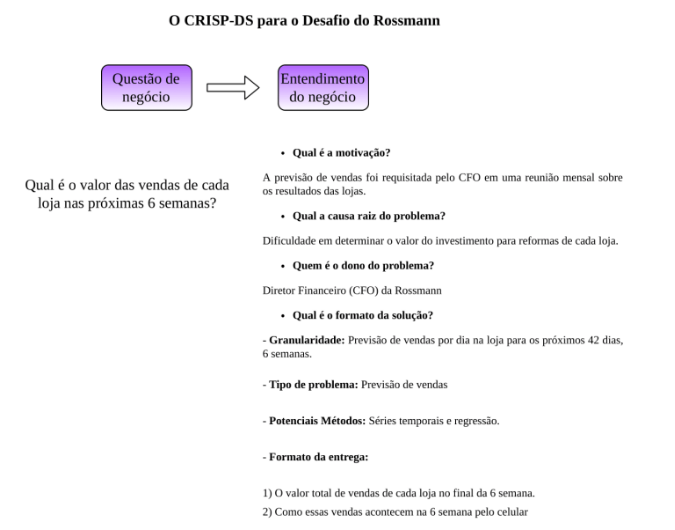
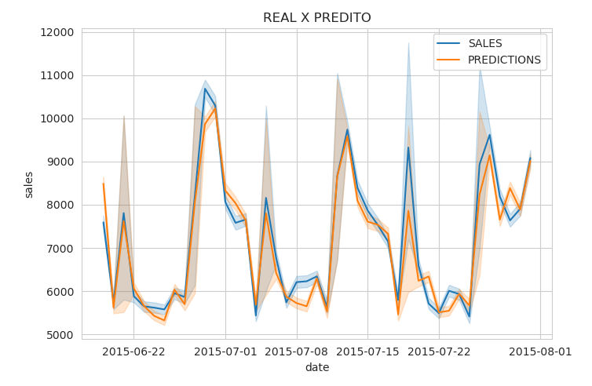

# Previsão de vendas das Lojas Rossmann


#

## Problema de negócio
A Rossmann é uma rede de drogarias que atua com várias lojas espalhadas na Europa. Foi solicitado, pelo CFO da empresa, uma previsão das vendas das próximas 6 semanas, essa decisão foi tomada por ele depois de várias discurssões em reuniões estratégicas de negócio com os gerentes das lojas. O CFO precisa realizar o planejamento das reformas das lojas, cuja o orçamento encontre-se conforme com as vendas de cada loja. Outro ponto questionado por ele é obter a proporção de vendas de cada loja nas próximas 6 semanas, além disso houve uma ressalta de um dos gerentes, se tem alguma forma de entender as lojas por grupos para saber as com menor performance de vendas, usadando técnicas estatísticas. 

## Entendimento do negócio


#

## Metodologia de desenvolvimento do projeto

O projeto foi densenvolvido em cima da metodologia CRISP-DM, ou seja, de forma cíclica executamos o andamento de cada etapa end-to-end do projeto.


#

## Entendendo os dados

As entidades , tabela de vendas e tabela de lojas, estão estruturadamente separadas. Ao todo são 1115 lojas, a janela de vendas é de janeiro de 2013 até junho de 2015. Então queremos projetar uma janela de 6 semanas a frente, isto é, do início de agosto a metade de setembro de 2015.

#
Dicionário dos dados

```
Id - um Id que representa um (Store, Date) duple dentro do conjunto de teste

Store - um ID único para cada loja

Sales - o volume de negócios em qualquer dia (isto é o que você está prevendo)

Customers - o número de clientes em um determinado dia

Open - um indicador para saber se a loja estava aberta: 0 = fechada, 1 = aberta

StateHoliday - indica um feriado estadual. Normalmente todas as lojas, com poucas exceções, fecham nos feriados estaduais. Observe que todas as escolas fecham nos feriados e finais de semana. a = feriado, b = feriado da Páscoa, c = Natal, 0 = Nenhum

SchoolHoliday - indica se (loja, data) foi afetado pelo fechamento de escolas públicas

StoreType  - diferencia entre 4 modelos de loja diferentes: a, b, c, d

Assortment - descreve um nível de sortimento: a = básico, b = extra, c = estendido

CompetitionDistance - distância em metros até a loja concorrente mais próxima

CompetitionOpenSince [Mês / Ano] - fornece o ano e mês aproximados em que o concorrente mais próximo foi aberto

Promo - indica se uma loja está fazendo uma promoção naquele dia

Promo2 - Promo2 é uma promoção contínua e consecutiva para algumas lojas: 0 = a loja não está participando, 1 = a loja está participando

Promo2Since [Ano / Semana] - descreve o ano e a semana em que a loja começou a participar da Promo2

PromoInterval - descreve os intervalos consecutivos em que a Promo2 é iniciada, nomeando os meses em que a promoção é reiniciada. Por exemplo, "fevereiro, maio, agosto, novembro" significa que cada rodada começa em fevereiro, maio, agosto, novembro de qualquer ano para aquela loja
```
#

## Performance do modelo

Na etapa de machine de learning usamos 4 algoritmos supervisionados, sendo dois deles lineares, um usando abordagens de ensemble e outro boosting. Usamos a técnica de validação cruzada TimeSeriesSplit para treinar e validar os modelos. Podemos observar os resultados nas tabelas abaixo:


**Modelo Baseline**

|       Model Name          |        MAE          |      MAPE      |        RMSE        |
|:-------------------------:|:-------------------:|:--------------:|:------------------:|
| Baseline                  |  1370.9611          | 1370.9611      | 1817.7475          |
#

**Modelos de ML**

|       Model Name          |        MAE CV       |     MAPE CV    |      RMSE CV       |
|:-------------------------:|:-------------------:|:--------------:|:------------------:|
| LinearRegression          |  1993.6811 +/- 76.462   | 31.0226 +/- 1.6417 | 2837.1881 +/- 156.0617 |
| Lasso                     |  2265.6284 +/- 72.894   | 31.0226 +/- 1.6417 | 3116.2092 +/- 141.0112 |
| RandomForestRegressor     |  991.713 +/- 187.257    | 14.9263 +/- 2.1626 | 1562.7588 +/- 310.9101 |
| XGBRegressor              |  1094.9393 +/- 164.1258 | 16.7581 +/- 1.7844 | 1574.0267 +/- 268.2362 |


**Legenda:**

Média +- Desvio padrão
#

Os dois primeiros modelos obtiverem resultado muito ruim, não conseguiram bater se quer o modelo baseline.

O algoritmo random forest conseguiu obter o melhor resultado olhando pelas métricas, embora o modelo xgboost tenha um resultado bem próximo.

Por mais que random forest tenha melhor resultado, vamos seguir com o modelo xgboost, um dos principais motivos é pelo fato de que na persistência do modelo ele consegue ser bem menor do que o random forest. Além disso o xgboost é um modelo performático, na maioria das vezes trazendo ótimos resultados, e como ainda iremos para a etapa de hiperparametrização é bem capaz de vir com melhor resultado.

#
**Modelo final**

|       Model Name          |          MAE        |       MAPE     |         RMSE       |       MPE        |
|:-------------------------:|:-------------------:|:--------------:|:------------------:|:----------------:|
| XGBRegressor              |        638.6199     |      9.4131    |       921.2621     |       -0.5608    |
#

Realmente conseguimos obter melhoria na peformance do xgboost.

Analisando as métricas percebemos:

1. MAE - Nos diz que o nosso modelo pode errar ~ $639 para cima ou para baixo.

2. MAPE - Nos diz o quão nosso modelo pode errar em uma previsão em porcentagem, ou seja, significa dizer o valor de ~ $639 equivale a ~ 10% em relação ao  valor total da previsão.

3. RMSE - Nos diz que podemos errar ~ 921 unidades da previsão. Uma observação a se atentar é que essa métrica tem sensibilidade a valores discrepantes, embora na maioria dos casos resulta maior que o MAE, caso o RMSE 2x > MAE precisa-se se atentar a investigações.

4. MPE - Nos diz que o modelo está superestimando nas previsões, ou seja, os valores estimados estão sendo maior que as vendas reais, por isso o resultado negativo, se fosse positivo estaria subestimando, na qual, os valores estimados estão sendo menor que as vendas reais.


**Gráfico do real x predito**


#

Agora iremos analisar como esses números podem impactar nos resultados de negócio.


## Resultados de negócio

Na tabela abaixo podemos ver 3 situações, o valor da previsão, o valor da previsão no melhor caso o valor da previsão no pior caso.

|    scenario    |	  values    |
|:--------------:|:------------:|
| previsões      |	R$ 287,217,728.00  |
| melhor caso    |	R$ 287,934,143.14  |
| pior caso      |	R$ 286,501,313.26  |
#

Como foi calculado esses casos? Simples!

1. Agrupamos os resultado pela loja e depois calculamos o somatório das previções. Com isso temos o valor total das previsões por loja.

2. Depois calculos o MAE para cada loja.

3. Para o melhor caso realiza-se o somatória da previsão total com o MAE para cada loja, e para o pior caso faz-se a subtração.

4. E no final podemos obter os valores totais da previsão, melhor caso e pior caso.


Mesmo no pior caso do resultado das vendas, da previsão de 6 semanas, ainda há um ótimo resultado. O erro está na casa de centena, enquanto as vendas na casa de milhões. Em conversa com o CFO isso ficou ainda mais claro.

## Resultado das previsões de 6 semanas

Na tabela abaixo podemos ver o resultado da previsão de vendas das próximas 6 semanas, observando a classificação das lojuas, vendas percentual e a quantidade de loja em cada grupo:


| classification |	percentage_sales |	frequency_store |
|:--------------:|:-----------------:|:----------------:|
|       G1       |	    36.036003	 |        214       |
|       G2       |	    26.001137	 |        214       |
|       G3       |	    21.438389	 |        214       |
|       G0       |	    16.524469	 |        214       |
#

Interpretando a tabela percebemos 4 grupos, em seguida suas vendas percentual e quantidade de lojas em cada grupo.

O grupo G1 são as lojas com as melhores vendas, os grupos G2 e G3 são lojas que possuem vendas medianas, o grupo G0 são lojas com o percentual de vendas bem baixas, são lojas que precisam ser investigas para saber porque da atual performance. Cabendo aos gerentes dessas lojas estudarem melhor métodos que ajudem a melhorar as vendas dessas lojas.  

Os grupos foram calculados da seguinte forma:

1. Usamos as medidas de quartis para calcular os grupos

2. Depois de obter as vendas totais de cada loja, calculamos os quartis 25, 50 e 75 do total de venda de todas as lojas.

3. Classificação dos grupos
    1. G1 - Lojas com vendas superior ao quartil 75
    2. G2 - Lojas com vendas maior ou igual ao quartil 50 e menor que o quartil 75
    3. G3 - Lojas com vendas maior ou igual ao quartil 25 e menor que o quartil 50
    4. G0 - Lojas com vendas menor que o quartil 25


E, aqui o total de vendas de todas as lojas das próximas 6 semanas, do início de agosto a metade de setembro de 2015

|               |    total_sales       |
|:--------------|:--------------------:| 
|  predictions  |    R$ 239,884,000.00 |
#

## API Rossmann

Neste momento chegamos na última etapa do CRISP, que é pôr o modelo em produção.

Para este projeto seguimos com a seguinte arquitetura:

1. Os dados estão disponíveis no mongodb no servidor do mongo atlas.
2. Criamos uma etapa de escoramento dos dados ao modelo, onde aqui é persistido as predições no banco de dados.
3. A API disponibiliza duas endpoints
    1. GET /predictions - Retorna todas as lojas
    2. GET /prediction/{store} - Retorna apenas a loja passada por parâmetro

Ex.: **/prediction/3**

```json
{
    "store": 3,
    "prediction": 272416.41,
    "formatted_sales": "R$ 272,416.41",
    "percentage_sales": 0.1135617271065712,
    "classification": "G2"
}
```

A API está disponível no servidor do heroku, aos que quiserem testá-la clique [link](https://api-rossmann.herokuapp.com)

## Conclusão

Finalizamos o primeiro cíclo do CRISP, e esse é o intregável. Ainda ha um mundo de possibilidades a fazer e ser investigado, mas isso pode ser feito nos próximos cíclos.

- [Blog](https://igobarros.herokuapp.com/)
- [Linkedin](https://www.linkedin.com/in/igo-pereira-barros-developer/)
- [Instagram](https://www.instagram.com/cienciaaosdados/)