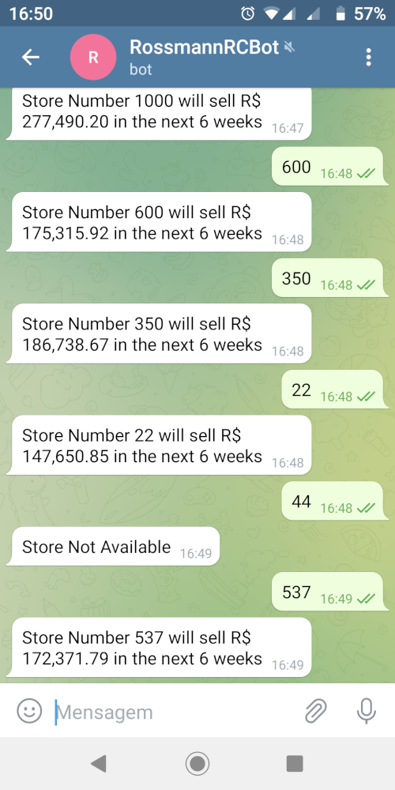

# Rossmann Sales Predict
###### This project has academic purposes.
# 

# 1. Business Problem.

Rossmann's is a big European drugstore. Some store managers call me to help them to predict sales for the next six weeks.
The root cause is a demand from the CFO, discussed at their weekly meeting: he needed to plan store renovations, and for that, the budget needs to be aligned with each store's sales.
Therefore, the principal stakeholder is the CFO, but from which all store managers will benefit.

# 2. Business Assumptions.

All data was taken from the company's internal sales base of the last 30 months. Any data coming from before this period would be seriously affected by external events (biased).
Several details were provided, such as type of store, variety of products offered and the competition proximity. Other variable info such as customers per day and sales per day, holidays, marketing promotions were available too.

However, it was necessary to assume some things. As you can see down below.

- **Conmpetition proximity**: Was expressed in meters but, sometimes it was zero. So, 'Zero Competition Distance' was the same as 'No Competition Proximity'. But, for ML Algorithms this input is a bias. In this case, I assumed a fixed value (100,000 m) higher than the highest value in the dataset.
- **Assortment**: I assumed there is a hierarchy between types. So, stores with Assortment Type C must offer Types A and B too.
- **Store Open**: I removed all the lines that indicate Store Closed, as we also had Zero sales on the same day. For ML purposes, this will be reviewed in future CRISP cycle.
- **Sales Prediction**: In agreement with the CFO, I presumed they would provide the total sales for eatch tore at the end of the sixth week.

My strategy to solve this challenge was based in CRISP-DM Cycle:

**00. Understand the Problem:** _The most important step for correct plan entire solution_.

**01. Data Description:** My goal is to use statistics metrics to identify data outside the scope of business.

**02. Data Filtering:** Filter rows and select columns that do not contain information for modeling or that do not match the scope of the business.

**03. Feature Engineering:** Derive new attributes based on the original variables to better describe the phenomenon that will be modeled.

**04. Exploratory Data Analysis:** Explore the data to find insights and better understand the impact of variables on model learning.

**05. Data Preparation:** Prepare the data so that the Machine Learning models can learn the specific behavior.

**06. Feature Selection:** Selection of the most significant attributes for training the model.

**07. Machine Learning Modelling:** Machine Learning model training

**08. Hyperparameter Fine Tunning:** Choose the best values for each of the parameters of the model selected from the previous step.

**09. Convert Model Performance to Business Values:** Convert the performance of the Machine Learning model into a business result.

**10. Deploy Model to Production:** Publish the model to a cloud environment so other people or services can use the results to improve the business decision. __In this particular case, the model can be accessible from a Telegram Bot__.

# 3. ML and Metrics

ML step may be the most interesting setp. There is were the 'magic' happens. Well, I tested four (4) Machine Learning Algoritms: Linear Regression, Lasso Regression, Random Forest Regressor and a XGBoost Regressor. The metrics applied to measure the performance of the algorithms were MAE, MAPE and RMSE.

So, the results from these metrics can be seen in the table below:

|       Model Name          |        MAE CV       |     MAPE CV    |      RMSE CV       |
|:-------------------------:|:-------------------:|:--------------:|:------------------:|
| Linear Regression         |  2082.46 +/- 295.78 | 30.26 +/- 1.66 | 2950.11 +/- 468.88 |
| Lasso Regression          |  2116.65 +/- 341.58 | 29.2  +/- 1.18 | 3056.56 +/- 504.44 |
| Random Forest Regressor   |  837.7   +/- 219.23 | 11.61 +/- 2.32 | 1256.59 +/- 320.26 |
| XGBoost Regressor         |  2889.54 +/- 343.25 | 34.54 +/- 1.39 | 3714.69 +/- 456.1  |
# 

My final choice of model was XGBoost.

What !?!? Why did I choose XGBoost over Random Forest ? See the RMSE above !

Well, I did it because the company's policy is to do not go over the budget ($0.00).

All ML projects have to be lined with budget. Can the final model be sustained by the business infrastructure?

Do the results (direct or indirect) affect, or are affected, by any internal company policy?

In this case, the model will be hosted on a free cloud (Heroku), where we have a space limitation. If I choose random forest, the final model would be 1GB. Meanwhile, with XGBoost, the model became much smaller.

The metric problems can be solved in "Hyperparameter fine tuning" step. 
Look the metrics after a better choice of parameters to train the model:

|    Model Name        |     MAE      |    MAPE%    |     RMSE       |
|:--------------------:|:------------:|:-----------:|:--------------:|
|  XGBoost Regressor   |   764.9756   |   11.4861   |   1,100.7251   |
# 
(RMSE better than Random Forest !)
_This is the result of a lot of work ... and a (very) little bit of experience._

# 4. Business Results.

It all appears to be good, beautiful ... but without converting these metrics in Business Words ... all the work can be ruined !
Business People don't understand RMSE. Maybe they understand MAE and MAPE, but 'cold' numbers they, certainly, understand. Graphics also help. 

For example, the table below show the TOTAL of predictions. Considering the best and worst cenarios.

|   Scenario     |      Values      |
|:--------------:|:----------------:|
| predictions    | $ 286,435,616.00 |
| worst_scenario | $ 285,579,535.55 |
| best_scenario  | $ 287,291,675.73 |

# 
Below we have a Scatter Plot with all the predictions. Notice that most are centered around a line parallel to the X axis (MAPE 11% in Y axis). However, there are points quite far apart. This is because there are stores for which the forecasts are not so accurate, while others are very assertive.

# 
Ok, but what does this deviation really represent? 

Check the table below for the 5 best cases.

|store|predictions|worst_scenario|best_scenario|MAE|MAPE|
|-----|-----------|--------------|-------------|---|----|
|1089|373,394.1875|372,825.1184|373,963.2566|569.0691|5.3232|
|667 |315,185.8438|314,693.4028|315,678.2847|492.4410|5.5487|
|323 |282,916.4688|282,488.0610|283,344.8765|428.4077|5.6277|
|742 |301,657.5312|301,199.1451|302,115.9174|458.3861|5.6393|
|1097|450,342.1562|449,703.2118|450,981.1007|638.9445|5.7761|

# 
And the table below with 5 worst cases.

|store|predictions|worst_scenario|best_scenario|MAE|MAPE|
|-----|-----------|--------------|-------------|---|----|
|292|108,359.7891|104,977.6086|111,741.9695|3,382.1804|60.2768|
|909|220,300.0781|212,395.1411|228,205.0152|7,904.9371|51.8675|
|876|194,060.8125|189,924.5347|198,197.0903|4,136.2778|33.7730|
|170|201,541.6875|200,194.4216|202,888.9534|1,347.2659|33.2923|
|749|206,800.9531|205,789.1920|207,812.7142|1,011.7611|28.3049|

# 
# 5. Sneak peak from Telegram Bot.
# 

# 6. Lessons Learned.

- Metrics are important, but they are not everything;
- Make more graphics, make better graphics;
- Keep your code clean;
- Plan... and re-plan your work;
- Git is your friend.

# 7. In the next cycle ?

- Better plots;
- More tests in ML algoritms;
- Build a pipeline to retrain model.

# 
# 
###### Edited with Haroopad

